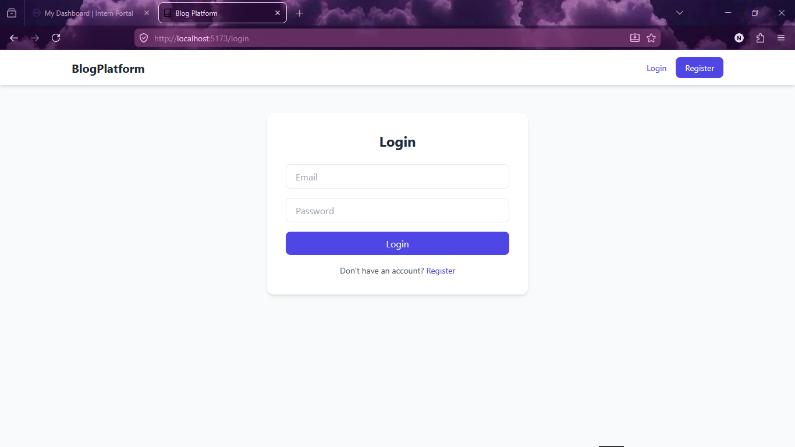
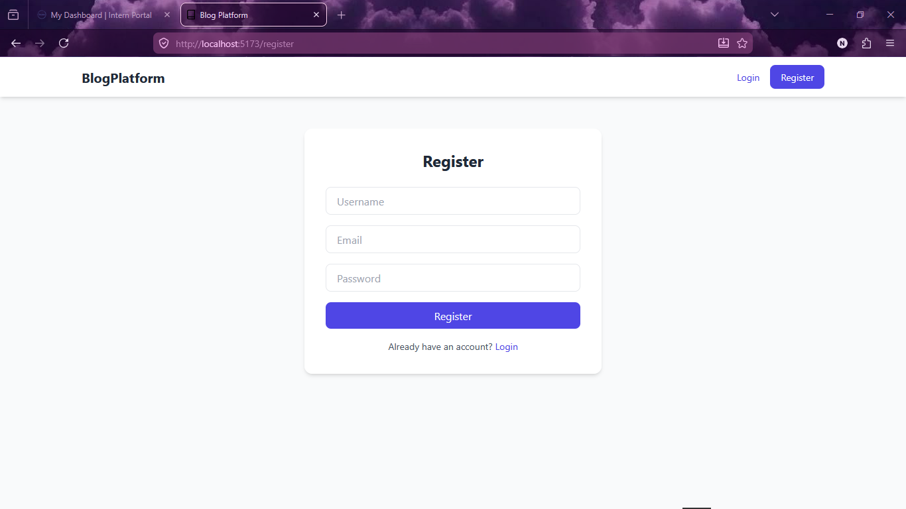
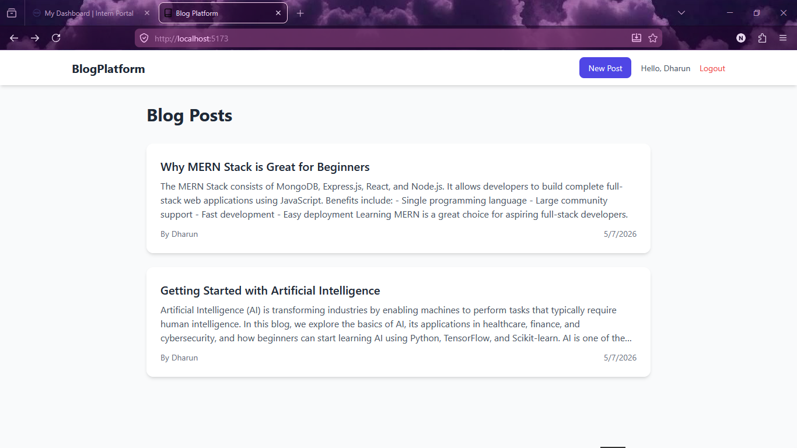
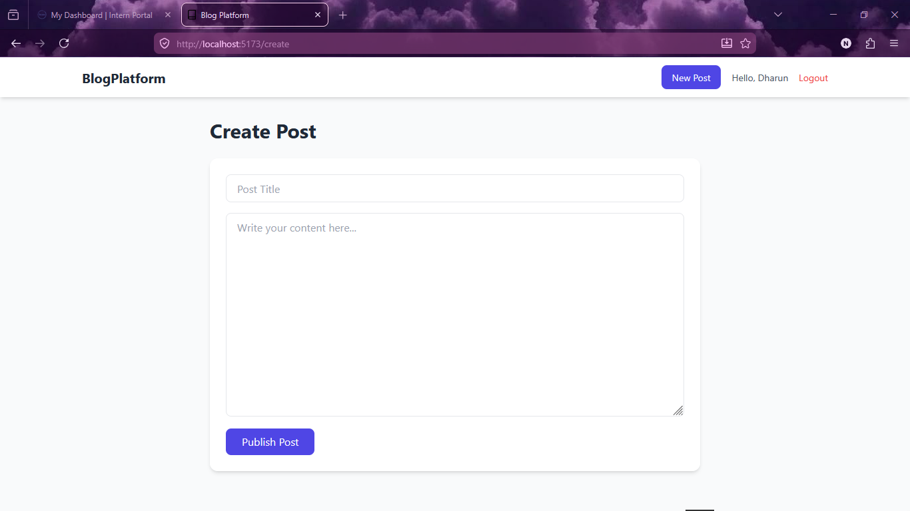

# 📝 Blog Platform

A full-stack **MERN Blog Platform** that enables users to register, log in securely, create and manage blog posts, and interact through comments. The application is built using **React**, **Node.js**, **Express.js**, **MongoDB Atlas**, and **JWT Authentication**.

---

## 🚀 Features

- 🔐 User Registration & Login
- 🔑 JWT Authentication
- ✍️ Create, Edit & Delete Blog Posts
- 📖 View All Blog Posts
- 💬 Add & Delete Comments
- 👤 Protected Routes
- 📱 Responsive User Interface
- 🌐 RESTful APIs
- ☁️ MongoDB Atlas Database Integration
- 🔒 Password Hashing with bcrypt

---

## 🛠️ Tech Stack

### Frontend
- React (Vite)
- React Router
- Axios
- Tailwind CSS

### Backend
- Node.js
- Express.js

### Database
- MongoDB Atlas
- Mongoose

### Authentication
- JWT (JSON Web Token)
- bcrypt

---

## 📂 Project Structure

```
blog-platform/
│
├── backend/
│   ├── config/
│   ├── controllers/
│   ├── middleware/
│   ├── models/
│   ├── routes/
│   ├── .env.example
│   ├── package.json
│   └── server.js
│
├── frontend/
│   ├── public/
│   ├── src/
│   │   ├── api/
│   │   ├── components/
│   │   ├── context/
│   │   ├── pages/
│   │   ├── App.jsx
│   │   ├── main.jsx
│   │   └── index.css
│   ├── package.json
│   └── vite.config.js
│
├── Screenshots/
├── README.md
└── LICENSE
```

---

## ⚙️ Installation

### 1️⃣ Clone the Repository

```bash
git clone https://github.com/your-username/blog-platform.git
cd blog-platform
```

---

### 2️⃣ Backend Setup

```bash
cd backend
npm install
```

Create a `.env` file inside the `backend` folder.

```env
PORT=5000

MONGO_URI=your_mongodb_connection_string

JWT_SECRET=your_secret_key

JWT_EXPIRE=7d
```

Start the backend server:

```bash
npm run dev
```

---

### 3️⃣ Frontend Setup

Open a new terminal.

```bash
cd frontend
npm install
```

Create a `.env` file.

```env
VITE_API_URL=http://localhost:5000/api
```

Run the frontend:

```bash
npm run dev
```

---

## 📌 API Endpoints

### Authentication

| Method | Endpoint | Description |
|---------|----------|-------------|
| POST | `/api/auth/register` | Register a new user |
| POST | `/api/auth/login` | Login user |

### Posts

| Method | Endpoint | Description |
|---------|----------|-------------|
| GET | `/api/posts` | Get all posts |
| GET | `/api/posts/:id` | Get single post |
| POST | `/api/posts` | Create post |
| PUT | `/api/posts/:id` | Update post |
| DELETE | `/api/posts/:id` | Delete post |

### Comments

| Method | Endpoint | Description |
|---------|----------|-------------|
| GET | `/api/comments/:postId` | Get comments |
| POST | `/api/comments/:postId` | Add comment |
| DELETE | `/api/comments/:commentId` | Delete comment |

---

## 📸 Screenshots

### Login Page



### Register Page




### Home Page



### Create Post




---

## 🔮 Future Enhancements

- ❤️ Like and Unlike Posts
- 🔍 Search Blog Posts
- 🏷️ Categories and Tags
- 🖼️ Image Uploads
- 👤 User Profiles
- 🌙 Dark Mode
- 📄 Pagination
- 🔔 Notifications

---

## 🤝 Contributing

Contributions, issues, and feature requests are welcome.

Feel free to fork this repository and submit a pull request.

---

## 📄 License

This project is licensed under the **MIT License**.

---

## 👩‍💻 Author

**Sivanesh.S**
